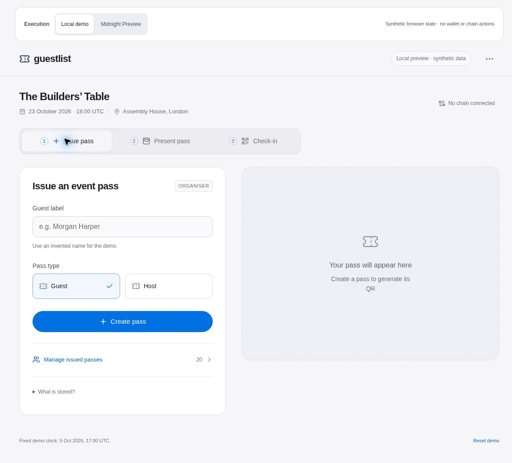
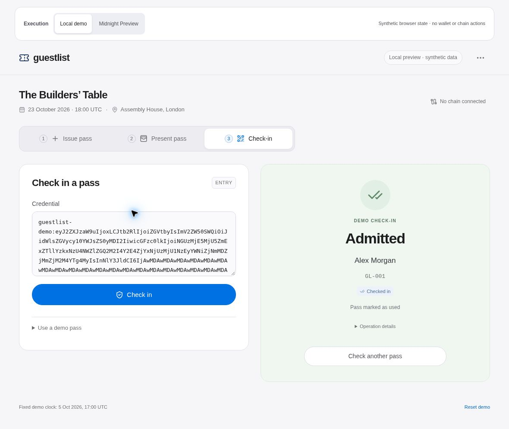

# Guestlist · Private event passes on Midnight

An AI-assisted portfolio prototype for a simple question: **can a guest prove they have a valid, unused invitation without putting their name on a public ledger?**

Guestlist pairs an Apple-informed, responsive event interface with an original Compact contract. It is a prototype, not a production admission system, an Apple Wallet integration, or a security-audited product.

## What actually works

- Organiser: issue a synthetic bearer pass, browse/filter guests, revoke an unused pass and inspect its history
- Attendee: view an event pass and a real encoded QR; copy its bearer credential
- Door: paste a credential, check its demo commitment and admit once; reject malformed, wrong-event, used, revoked and expired preview passes
- UI: clear local-preview/network-disconnected labels, loading/rejection/success states, accessible native dialogs, keyboard navigation and reduced-motion support
- Original Compact: issuer-secret authorization, event-bound commitments, one issuance per commitment, bearer-secret redemption, atomic ACTIVE → USED/REVOKED, permanent tombstones
- Contract evidence: actual full compiler output including keys, generated-runtime tests and compiler-negative checks
- Genuine local cryptographic evidence: issue, redeem and revoke proofs generated with the official WASM prover, each passing witness constraints and mandatory cryptographic prover self-verification. A wrong-verifier control rejects. The published ledger WASM structural check is not independent cryptographic proof verification
- Browser integration: actual API-4 wallet/prover providers, authenticated Compact assets, encrypted owner storage and transaction-attributed finalized receipts. Offline evidence and remaining owner/network prerequisites are in `browser-integration/README.md`. The earlier `integration/` Node live adapter is retired and fails closed

**Local demo is the default and uses only synthetic browser state. Midnight Preview mode wires the genuine SDK, owner-operated role custody, wallet/prover reviews, circuit operations, read-only recovery and the gate client. The original contract was actually deployed by its owner on Preview and independently verified. Network issue/redeem/revoke and live gate admission are still in progress, not passed acceptance tests.**

### Verified Preview deployment

- Contract: `856fb78cc68d912c92e1c1bf33afaced96cb35baa5d0973daaab93eaadca0c65`
- Successful deployment transaction: `003ccdf04e97f8670e725cb37d7a1a0603f2d324b997cd9ce7c71a6578683a9954`
- Canonical finalized block: **1169309**; original issue/redeem/revoke verifier keys match
- Independent official node/indexer read, 5 October 2026: [minimal public receipt and state evidence](evidence/testnet/deployment-independent-read.json)
- No owner private recovery file, wallet seed or signing key is included

### Interface preview

These native browser captures show the functional **synthetic local demo**, not network admission:





[Mobile pass capture](evidence/current-browser/mobile-pass-390.png) · [Dated QA and limits](docs/qa-checklist.md)

The `proof-check/` scripts generated real local proofs for all three circuits using public test witnesses. Those are cryptographic prover checks, not wallet-balanced, submitted or network-finalized transactions. See the dated hash-pinned evidence. Never describe live mode capability or a consent dialog as completed deployment.

## Reproduce the browser app

Tested Node **24.19.0** and npm **11.9.0**. Direct package versions and all transitive integrity hashes are pinned in the lockfile.

```sh
npm ci
npm run install:packages
npm run dev
```

Open the local URL printed by Vite (default `http://127.0.0.1:4173`). Use localhost or HTTPS because the demo needs Web Crypto. No environment variables, credentials or paid services are needed. The synthetic preview clock is intentionally fixed at 5 October 2026, 17:00 UTC, so the portfolio remains replayable. It is not a real admission time check.

```sh
npm test             # synthetic domain/service + live-controller offline tests
npm run check        # TypeScript, including unit/UI test sources
npm run build        # typecheck + static production build
npm run verify:offline # all active offline layers, legacy retirement, hashes/audit patterns/build
npm run verify:compiler # installed official 0.31.1 compiler + negative/runtime tests
npm run test:e2e     # separate desktop/phone browser flows
```

The end-to-end suite needs a Chromium installation. By default it uses `/usr/bin/chromium`; set `CHROMIUM_PATH` to another executable if needed. A supplied `GUESTLIST_TEST_URL` tests that origin without starting Vite. Keep that origin accessible using an explicitly authorized account; do not make a private site public to run tests. See `docs/qa-checklist.md` for the actual passed, blocked and unrun checks.

## Reproduce the actual contract

```sh
npm --prefix contracts ci --ignore-scripts
npm run test:contract
```

The generated JS is executed with official Compact runtime **0.16.0**. To rebuild source with the tested official compiler **0.31.1**:

```sh
COMPACTC=/absolute/path/to/compactc npm run compile:contract
COMPACTC=/absolute/path/to/compactc npm run test:compiler
```

The current official support-matrix compiler **0.31.1** was actually downloaded from its official release, checksum-verified and used for a full successful compilation. Its JS/types, keys and ZKIR match the earlier 0.31.0 artifacts byte for byte; the historical local proof remains correctly attributed. Matching pins and local success are not deployment validation. See `contracts/README.md` for exact versions, comparison hashes, writable-cache setup and build evidence.

## Public vs private

Live-contract public state: event ID, issuer commitment, permanent pass commitment/status entries and aggregate counts. The pass commitment is event- and domain-bound.

Private inputs: the issuer credential secret and bearer credential secret. Names and emails are not contract inputs. A scanner receiving a bearer QR sees the secret; proof infrastructure may also see private witness inputs. Public commitments, state transitions, timing and transaction metadata remain linkable. **Offchain names are not a guarantee of anonymous attendance.**

The browser-only adapter uses an explicitly different SHA-256 demo encoding, not Compact `persistentHash`. Never carry its fixtures or credentials into a network deployment. It stores synthetic labels and secrets in this browser’s local storage. That storage is not a secure real-credential vault.

## Important limits

- Anyone with a copied bearer QR could redeem first; the contract does not establish named identity, physical presence, scanner authorization or nontransferability
- Bearers can consume a pass remotely; a real gate must wait for a finalized accepted transaction and independently read confirmed state
- Two stale local ACTIVE snapshots can both prepare successfully; local computation is not network concurrency protection
- Demo expiry, 72-person capacity, Guest/Host labels and request idempotency are UI rules. The current Compact contract does not enforce them
- No issuer recovery/rotation exists; losing the sole issuer credential prevents further issuance/revocation
- All three local WASM circuit proofs passed built-in cryptographic prover self-verification. The separate ledger WASM only performs structural checks; its synthetic transaction fixture disables fee balancing. The owner reported local prover8.1.0 and test funding; original deployment/finality is independently verified. Network circuit lifecycle and operational gate acceptance remain unverified
- Gate-service enforces one durable grant across local processes, but the unchanged bearer contract cannot cryptographically distinguish self-consumption after an authenticated gate opens; physical entry is an operational trust boundary
- A lost grant response is never automatically re-admitted. Gate reachability/TLS, authentication authority and consistent durable backup are owner-controlled deployment steps

## Product and interview material

- [Product brief](docs/product-brief.md)
- [Architecture and private/public flow](docs/architecture.md)
- [Threat model](docs/threat-model.md)
- [Decision log](docs/decisions.md)
- [Apple product references](docs/design-references.md)
- [QA checklist and evidence](docs/qa-checklist.md)
- [Owner Preview setup and release gate](docs/owner-testnet-setup.md)
- [Genuine local proof reproduction](proof-check/README.md)
- [Live Preview flow](docs/live-preview.md)
- [Durable gate service](gate-service/README.md)
- [Three-minute demo](docs/demo-walkthrough.md)
- [Interview explanation](docs/interview-guide.md)
- [Honest human/AI attribution](docs/ai-assistance.md)

Archie chose the event-pass project, requested an Apple-informed polished interface and directed the portfolio outcome. AI assisted research, original contract/UI/integration implementation, tests and documentation. Further human review/understanding and complete network lifecycle acceptance remain separate milestones. Do not claim independent manual authorship, security-audited production readiness or a completed gate demonstration from this repository.

## Rights and third-party dependencies

No open-source license grant for the original project has been selected. Dependencies retain their own licenses; see [THIRD_PARTY.md](THIRD_PARTY.md). Apple images, logos, fonts and product code are not bundled. Apple products are references only. No Apple or Midnight endorsement is implied.

## Current release scope

The reviewed recovery picker restores only empty public metadata after owner approval. Shared public request history uses atomic native Web Locks, monotonic receipts and exact-scope read-only journal recovery; there is no unlocked production fallback. The gate service has offline tested owner-only provisioning and durable claim logic, but **live acceptance remains unverified**. A real Preview read identified that SDK exact-action-block queries cannot serve arbitrary-head as-of baselines; a dedicated as-of reader is being validated separately. The release does not claim a working physical gate before that boundary and owner infrastructure are accepted.
